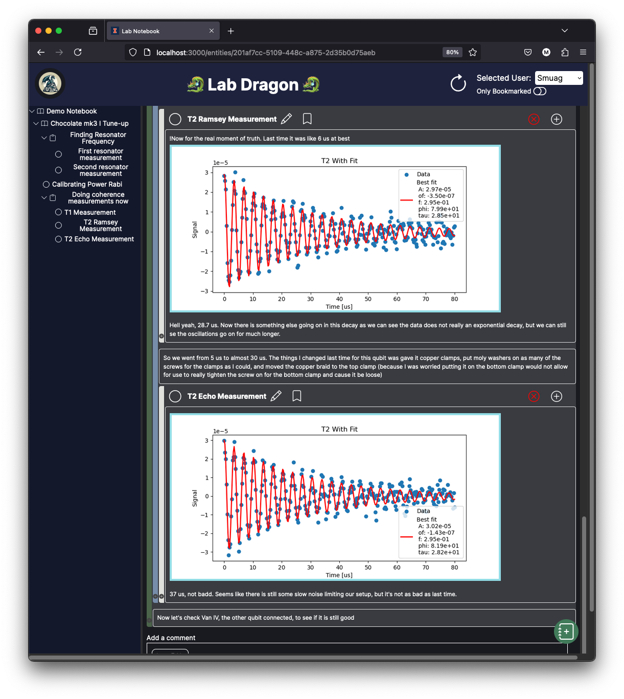

# Lab Dragon

Lab Dragon is an Electronic Lab Notebook (ELN) for scientists. It is a web application that allows you to create, edit, and share your lab notes. It is designed to be easy to use and to help you keep track of your experiments while also integrating deeply with your lab software.

Please note that Lab Dragon is still very early in development, both in terms of features and looks and the system as a whole. Everything is subject to change.

## QuickStart

The fastest way to run a self-hosted demo version of Lab Dragon is to use the provided docker-compose file with the provided example configuration files. To get that started:

> [!WARNING]
> Any data written in the notebook will be deleted if the docker-compose is restarted. For a persistent notebook some settings need to be changed, please see the next section for more information.

1. Clone the repository: At the moment we do not have Lab Dragon in any package managers so you will need to clone the repository to your local machine. You can do this by running the following command in your terminal where you keep your git projects:
    ```bash
    git clone https://github.com/ncsa/lab-dragon.git
    ``` 
2. Delete the `example-` from the `example.env` and `example-users.txt` files in the root of the project. This will start Lab Dragon with a demo notebook and the users 'guest' and 'guest2' with the password 'guest' and 'guest2' respectively.
3. Start the docker-compose file. If you don't have docker installed you can download it from [here](https://www.docker.com/products/docker-desktop). Once you have docker installed you can run the following command in the root of the project:
    ```bash
    docker-compose up --build
    ```

## Slightly less quick start

If you want to be able to have persistent data and actually use Lab Dragon, a few configurations are required. 

Lab Dragon has two different configuration files. The first one is the `.env` file. This file is used to configure both the core (API server) and the scales (web-app). The file should be located wherever the docker-compose file is run. To use is simply modify the `example.env` file in the root of the project and remove the `example-` from the filename. **DON'T FORGET TO TURN THE `CREATE_TESTING_ENVIRONMENT` VARIABLE TO `False`**. This will prevent the backend from deleting all of the files in the `NOTEBOOK_ROOT` directory.

> [!WARNING]
> When the variable `CREATE_TESTING_ENVIRONMENT` is set to `True`, the backend will delete all of the files in the `NOTEBOOK_ROOT` directory to create the new demo notebook.

The second config file that we need is a users file called `users.txt`. This file is picked up by the Traefik service in the docker-compose to add some basic security to the notebook until we can implement proper user management.

In the root of the project there is an example file called `example-users.txt` with the users 'guest' and 'guest2' with the encrypted password 'guest' and 'guest2'. To quickly run the notebook simply remove 'example-' from the filename To generate your own users with encrypted passwords simply run the following command in a unix environment:

```bash
echo $(htpasswd -nb <user_name> <password>) | sed -e s/\\$/\\$\\$/g
```

For example, to generate a user called 'guest' with password 'guest' you wuold run:

```bash
echo $(htpasswd -nb guest guest) | sed -e s/\\$/\\$\\$/g
```

Simply copy the output of this command into a file called `users.txt` next to the `.env` file. These users and passwords will be used for the server to let you access the notebook, they have nothing to do with the users of the notebook. Further user management will come at a later date.

Lastly you will need to create a root toml file for the notebook. The simplest way of doing this would be to create an empty text file, copy `53aa35ec_Example_project.toml` in your `VOLUME_ORIGIN` path, and fill in the fields: Name, user, start_time, end_time. Don't forget to replace the name both in the first line of the TOML as well as the actual name field. Don't forget to rename the last part of the file name. The first 8 characters come from the ID of the entity itself. 

Once all of those steps are taken, simply run the docker-compose file in the same way as the quick start and the notebook should be running.

## Running it without docker

You can also run Lab Dragon without using docker. For that you need to run both dragon-core as well as dragon-scales. More instructions on how to run both services are located in the README file for each service.

## Getting help

If you tried using Lab Dragon but have questions or need help, please send an email to: marcosf2@illinois.edu. Further community tools will be added in the future.
